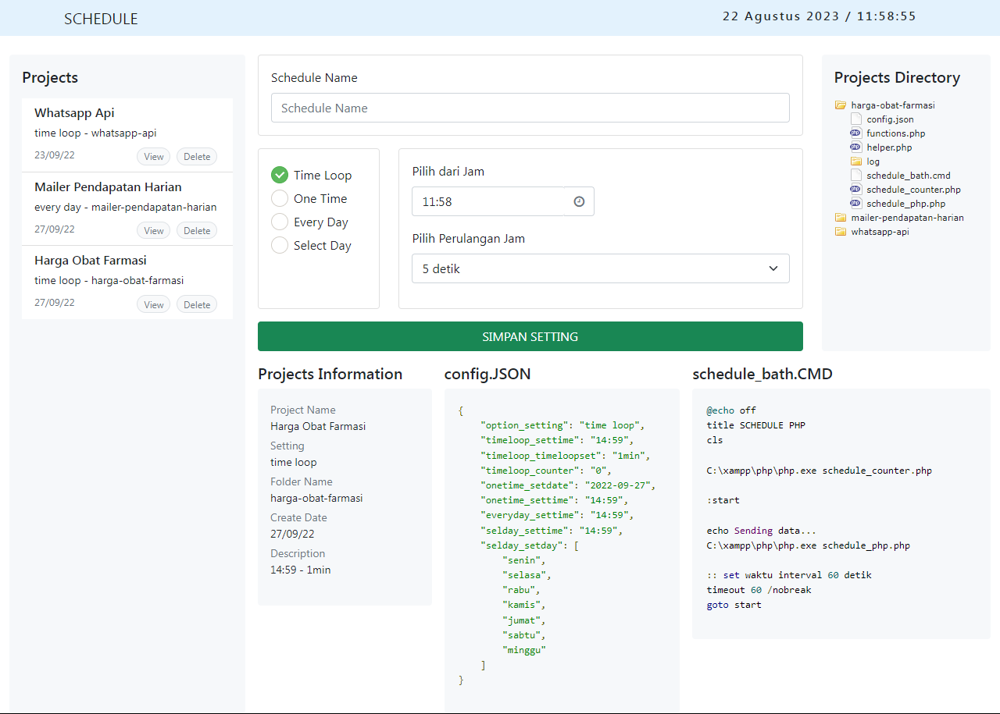

# scheduler-managing-services
## Description
create scheduler for project and managing all services

## App Available
1. Create project scheduler UI
2. Tersedia logs pada masing-masing project
3. Scheduler time setup
   - Time Loop
   - One Time
   - Every Day
   - Select Day
4. View, edit, delete and auto backup deleted project

## Instruction
1. Open master browser : `http/https:your-local-ip/php_schedule_service/`
2. Create scheduler your project
3. Open your project directory in `php_schedule_service/projects`
4. Create code PHP your function /process in file `php_schedule_service/projects/your-project-name/functions.php`
5. Jalankan file `schedule_bath.cmd`

## Capture

